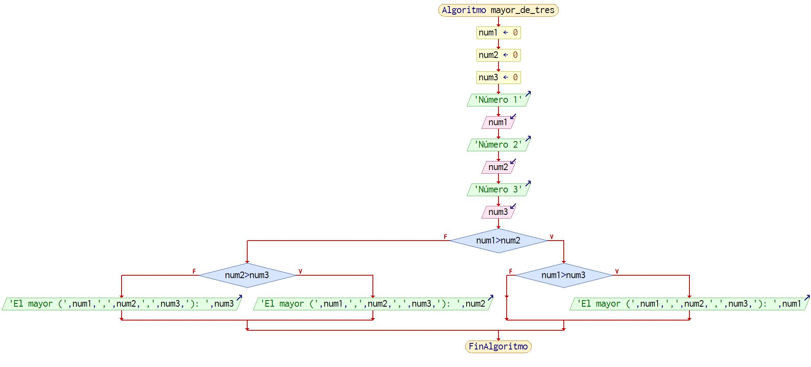

# JavaScrip

_JavaScript_ es un __lenguaje de programación de alto nivel__. Se trata e un lenguaje interpretado y no compilado.

  En un _lenguaje compilado_, la máquina de destino traduce directamente el programa. En un __lenguaje interpretado__, el código fuente no es directamente traducido por la máquina de destino.

El estándard que sigue hoy en día es [ECMAScript](https://es.wikipedia.org/wiki/ECMAScript)

  JavaScript fue desarrollado originalmente por __Brendan Eich__ de _Netscape_ con el nombre de Mocha, el cual fue renombrado posteriormente a _LiveScript_, para finalmente quedar como __JavaScript__.

Aquí tenemos a nuestro héroe


# Repaso rapidito

## Variables

- Una __variable__ es un _contenedor de información_  que apunta a un lugar de memoria
- La variables que no pueden modificarse se llaman __constantes__
- Clasificación de variables según su tipo
  1. __Primitivos__ o __inmutables__ (number, string, boolean, bigint, undefind, Symbol)
  2. De __referencia__ o __mutables__, en definitva todos los que no son primitivos
  3. No está en esta clasificación pero ponemos el caso raro o bug __null__
- Las __variables__ y __constantes__ se deben siempre declarar en ES6 con las palabras reservadas __let__ o __const__

  ```js
  // Definición (utilizando camelCase) e iniciación de una variable
  let newAge = age
  const PI = 3.1416
  ```

## console.log

Para depurar nuestro código y ver resultados como desarrolladores disponemos del uso de la consola. Hay varias opciones para lanzarla: 
- Comando __node__ si tenemos instalado __nodejs__
    node fichero.js
- Navegador, por ejemplo:
    - Escribir en la barra de direcciones __about:blank__ o abrir una pestaña del navegador en cualquier pestaña
    - Abrir el inspector e ir a la opción de la consola

## Enlaces de interés

- [Apuntes de Bluuweb](https://bluuweb.dev/04-javascript/javascript.html)
- [MDN JavaScript](https://developer.mozilla.org/es/docs/Web/JavaScript/Guide)
## Funciónes básicas de entrada y salida de datos

### Entrada de datos:
  1. Función __prompt()__. _⚠️ Sólo para desarrollo_

```js
let nombre = prompt('Dame tu nombre','Xurxo') // El segundo argumento es opcional
```


### Salida de datos
  1. Función __alert()__. _⚠️ Sólo para desarrollo_

```js
let nombre = prompt('Dame tu nombre','Xurxo') // El segundo argumento es opcional
alert('Mi nombre es ' + nombre) // Cuando sumamos / unimos strings el operador + es de concatenación
```

## [Estructura de control if]((https://www.freecodecamp.org/espanol/news/javascript-if-else-y-if-then-sentencias-condicionales-en-js/))

Con esta estructura de control podemos tomar decisiones. Esta estructura _no es un función_ a pesar de los paréntesis.

### Sintaxis
    
```js
if (condicion) {
  sentencias
} else {
  sentencias
}
```

### Explicación rápida

El __if...else__ es un __tipo de instrucción condicional__ que ejecutará un bloque de código cuando la condición de la instrucción if sea _veraz_ __truthy__. Si la condición es _falsa_ __falsy__, se ejecutará el bloque else.

Los valores veraces truthy y falsos falsy __se convierten en verdaderos__ true o falsos false en las sentencias if.

Ejemplo: En lógica cualquier número diferente de 0 es __truthy__ por tanto en una instrucción if se convierte a true. Ejemplo

```js
if (3) { // 3 es truthy y por tanto se convierte en true
  console.log('No es un cero')
} else {
  console.log('Es un cero') // Nunca se cumple esta sentencia
}
```
Aquí hay una lista de valores falsos falsy:

- false
- 0 ('number')
- -0 (cero negativo)
- 0n (BigInt cero)
- "", '', \`\`  (empty string)
- null
- undefined
- NaN (Not a Number)

## <abbr title="Not a Number">NaN</abbr>

Esta __expresión literal__ se muestra cuando la __expresión__ <strong>NO</strong> es un número

```js
console.log(0 / 0) 
// -> NaN. Puesto que esta operación no es posible
```

  ⚠️⚠️⚠️ No sirve para que evaluar puesto que:

  ```js
  NaN ===NaN // >> false
  ```

Para ello existe una función para saber si una expresión se trata de un __Not a Number__:  isNaN()

```js
console.log(isNaN('Xurxo')) 
// -> true. Puesto que 'Xurxo' no es un número
```
__isNaN()__ es útil con estructras de control como __if__ que veremos pronto pronto pronto que es ya
  
## Estructuras de control. Bucles

Las estructuras denominadas __bucles__ nos permiten realizar tareas repetitivas mientras que una __condición sea truthy__. A continuación mostramos dos de las más comunes.

### while

```js
let name = 'George' // Declaración e incialización de variables
let size = name.length // tamaño de un string
let i = 0 // Una variable que sirve de índice para recorrer el string

// Bucle while
while ( i < size) { // Mientra que la condición sea truthy dará vueltas // ⚠ OJO a los BUCLES INFINITOS
  console.log(name[i])
  i++ // incrementamos índice
}
```

## for
Nos facilita las cosas

```js
let name = 'George' // Declaración e incialización de variables
for (let x = 0; x < name.length; x++) {
   console.log(name[x])
}
```

## Datos no primitivos o mutables

### Arrays, vectores, listas o matrices

Nos permiten coo indica su nombre guardar colección de datos primitivo o no pritivos.
A continuación algunas de las operaciones que podemos realizar con los arrays.

```js
// Inicializar una lista, vector o array
const newArray = []

// Array con datos
const names = ['Xurxo', 'Irene', 'Manuel']

// Recorrido de un array
for (let i = 0; i < names.length; i++) {
  console.log(names[i])
} // >> 'Xurxo', 'Irene', 'Manuel'

// Añadir un elemento a un array
newArray.push(1) // >> [1]
newArray.push(2) // >> [1, 2]

// Eliminar último elemento de un array
const removedItem = names.pop() // >> ['Xurxo', 'Irene']
```

## Ejercicios básicos

1. [x] Escribe un programa de una sola línea que haga que aparezca en la pantalla un alert que diga “Hello World”.
2. [x] Realiza el mismo ejercico que el anterior pero mostrándolo en una variable
3. [x] Escribe un programa de una sola línea que escriba en la pantalla el resultado de sumar 3 + 5.
4. [x] Escribe un programa de dos líneas que pida el nombre del usuario con un prompt y escriba un texto que diga “Hola nombreUsuario”
5. [x] Escribe un programa de tres líneas que pida un número, pida otro número y escriba el resultado de sumar estos dos números.
6. [x] Escribe un programa que pida dos números y escriba en la pantalla cual es el mayor.
7. [x] Escribe un programa que pida 3 números y escriba en la pantalla el mayor de los tres.

8. [x] Escribe un programa que pida un número y diga si es divisible por 2
9. [x] Escribe un programa que pida una frase y escriba cuantas veces aparece la letra a (No hay que escribir acentos)
10. [x] Escribe un programa que pida una frase y escriba las vocales que aparecen (No hay que escribir acentos y sólo minúsculas)
11. [x] Escribe un programa que pida una frase y escriba cuántas de las letras que tiene son vocales (No hay que escribir acentos)
12. [x] Escribe un programa que pida una frase y escriba cuántas veces aparecen cada una de las vocales
13. [] Escribe un programa que pida un número y nos diga si es divisible por 2, 3, 5 o 7 (sólo hay que comprobar si lo es por uno de los cuatro)
14. [] Añadir al ejercicio anterior que nos diga por cual de los cuatro es divisible (hay que decir todos por los que es divisible)
15. [] Escribir un programa que escriba en pantalla los divisores de un número dado
16. [] Escribir un programa que escriba en pantalla los divisores comunes de dos números dados
17. [] Escribir un programa que nos diga si un número dado es primo (no es divisible por ninguno otro número que no sea él mismo o la unidad)